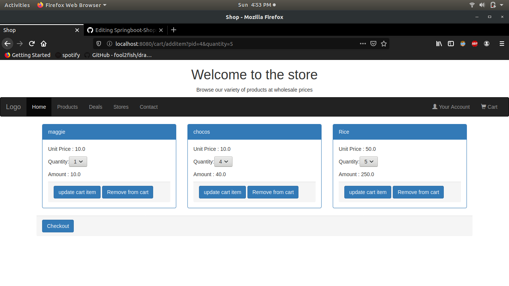

# Springboot-Shopping-Cart
A simple shopping cart application using springboot,jsp and psql.

Preview:

Existing features:
* Browsing through products
* Adding products to carts
* Editing cart items
* Generating checkout bill with total price info

Features needed:
* Admin login to add,delete and manage stocks of products
* Sessions
